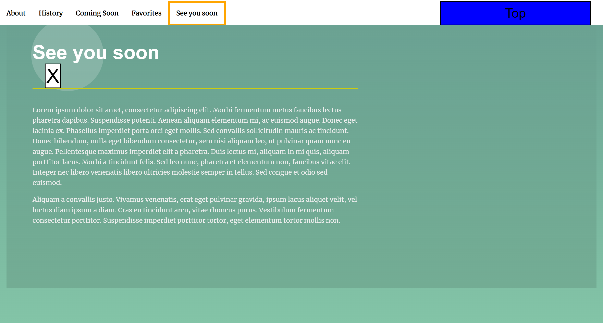

# landing-page

## Ed OConnor

### Udacity Project 2 Landing Page

This is the second projects in the Udacity Front End Developer Nanodegree.
For this project I used vanilla JS to add many different forms of functionality
to this landing page. Pay close attention to what happends as you scroll the page,
click the links and buttons in the Navbar, and mouse your mouse to the Navbar area
after the Navbar as become hidden. Also included are buttons for collapsing and
restoring each section. Thanks you for checking out my project.

## Top

![To[]](images/Example.png)

## Bottom

### How to get started

**First Clone the repo**

**yarn install**

**yarn start**

### Site Can Be Found Here 

[Landing Page](landing-page234.netlify.app)
